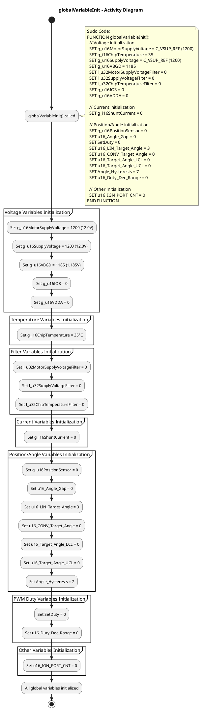

# SW Detailed Design Document
## Function: globalVariableInit

---

## 1. Description

`globalVariableInit` 함수는 시스템 시작 시 모든 전역 변수를 초기값으로 설정하는 초기화 함수입니다. 이 함수는 main 함수의 초기 단계에서 호출되어 전압, 온도, 전류, 센서, 제어 파라미터 등의 전역 변수를 안전한 기본값으로 초기화합니다.

**Location**: `src/main.c:159-181`

**Purpose**:
- 시스템의 모든 전역 변수를 정의된 초기값으로 설정
- 예측 가능한 시스템 시작 상태 보장
- 정의되지 않은 변수 값으로 인한 오작동 방지

---

## 2. Calling Function

| Function Name | Location | Description |
|---------------|----------|-------------|
| `main` | src/main.c:189 | 시스템 메인 함수에서 watchdog 비활성화 직후 호출 |

**Call Context**:
```c
int main(void)
{
    /* Initialize watch-dogs, both analogue and digital */
    WDG_disableIwdIt();

    /* Initialize globalVariable */
    globalVariableInit();  // <-- Called here

    /* Log reset source */
    log_reset_source();
    ...
}
```

---

## 3. Called Function

**None** - 이 함수는 다른 함수를 호출하지 않고 순수하게 전역 변수 초기화만 수행합니다.

---

## 4. Input Parameters

| Type | Name | Range | Description |
|------|------|-------|-------------|
| void | - | - | 입력 파라미터 없음 |

**Note**: 이 함수는 매개변수를 받지 않으며, 전역 변수에만 접근합니다.

---

## 5. Output Parameters

| Type | Name | Range | Description |
|------|------|-------|-------------|
| void | - | - | 반환값 없음 |

**Modified Global Variables**:

### 5.1 Voltage Related Variables
| Variable | Type | Initial Value | Unit | Description |
|----------|------|---------------|------|-------------|
| `g_u16MotorSupplyVoltage` | uint16_t | 1200 | 10mV | 모터 공급 전압 (12.0V) |
| `g_u16SupplyVoltage` | uint16_t | 1200 | 10mV | 시스템 공급 전압 (12.0V) |
| `g_u16VBGD` | uint16_t | 1185 | 1mV | 아날로그 공급 전압 (1.185V) |
| `g_u16IO3` | uint16_t | 0 | 1mV | IO3 전압 |
| `g_u16VDDA` | uint16_t | 0 | 1mV | VDDA 전압 |

### 5.2 Temperature Related Variables
| Variable | Type | Initial Value | Unit | Description |
|----------|------|---------------|------|-------------|
| `g_i16ChipTemperature` | int16_t | 35 | °C | 칩 온도 |

### 5.3 Filter Related Variables
| Variable | Type | Initial Value | Unit | Description |
|----------|------|---------------|------|-------------|
| `l_u32MotorSupplyVoltageFilter` | uint32_t | 0 | - | 모터 공급 전압 필터 누적값 |
| `l_u32SupplyVoltageFilter` | uint32_t | 0 | - | 공급 전압 필터 누적값 |
| `l_u32ChipTemperatureFilter` | uint32_t | 0 | - | 칩 온도 필터 누적값 |

### 5.4 Current Related Variables
| Variable | Type | Initial Value | Unit | Description |
|----------|------|---------------|------|-------------|
| `g_i16ShuntCurrent` | int16_t | 0 | - | 션트 저항 전류 |

### 5.5 Position/Angle Related Variables
| Variable | Type | Initial Value | Unit | Description |
|----------|------|---------------|------|-------------|
| `g_u16PositionSensor` | uint16_t | 0 | - | 위치 센서 값 |
| `u16_Angle_Gap` | uint16_t | 0 | - | 각도 갭 |
| `u16_LIN_Target_Angle` | uint16_t | 3 | - | LIN 목표 각도 |
| `u16_CONV_Target_Angle` | uint16_t | 0 | - | 변환된 목표 각도 |
| `u16_Target_Angle_LCL` | uint16_t | 0 | - | 목표 각도 하한 (Lower Control Limit) |
| `u16_Target_Angle_UCL` | uint16_t | 0 | - | 목표 각도 상한 (Upper Control Limit) |
| `Angle_Hysteresis` | uint16_t | 7 | - | 각도 히스테리시스 |

### 5.6 PWM Duty Related Variables
| Variable | Type | Initial Value | Unit | Description |
|----------|------|---------------|------|-------------|
| `SetDuty` | uint16_t | 0 | - | 설정된 PWM 듀티 |
| `u16_Duty_Dec_Range` | uint16_t | 0 | - | 듀티 감소 범위 |

### 5.7 Other Variables
| Variable | Type | Initial Value | Unit | Description |
|----------|------|---------------|------|-------------|
| `u16_IGN_PORT_CNT` | uint16_t | 0 | - | IGN 포트 카운터 |

---

## 6. Specification

### 6.1 Functional Requirements

**FR-01**: 전압 변수 초기화
- 모터 및 시스템 공급 전압을 12V (1200 x 10mV)로 설정
- 아날로그 공급 전압을 1.185V (1185 x 1mV)로 설정
- IO 관련 전압을 0으로 초기화

**FR-02**: 온도 변수 초기화
- 칩 온도를 상온 35°C로 설정

**FR-03**: 필터 변수 초기화
- 모든 필터 누적값을 0으로 초기화하여 필터 동작 준비

**FR-04**: 전류 변수 초기화
- 션트 전류를 0으로 초기화

**FR-05**: 각도/위치 제어 변수 초기화
- LIN 목표 각도를 3으로 설정
- 각도 히스테리시스를 7로 설정
- 나머지 각도 관련 변수는 0으로 초기화

**FR-06**: PWM 제어 변수 초기화
- 모든 PWM 듀티 관련 변수를 0으로 초기화

### 6.2 Non-Functional Requirements

**NFR-01**: 실행 시간
- 함수 실행 시간은 100μs 이내여야 함 (단순 변수 할당만 수행)

**NFR-02**: 메모리 안전성
- 모든 전역 변수는 정의된 범위 내의 값으로 초기화
- 메모리 오버플로우 없음

**NFR-03**: 호출 시점
- 반드시 main 함수에서 watchdog 비활성화 직후, 다른 초기화 함수 호출 전에 실행

### 6.3 Constraints

- 이 함수는 재진입 가능하지 않음 (non-reentrant)
- 인터럽트 컨텍스트에서 호출되지 않음
- 시스템당 정확히 1번만 호출되어야 함

### 6.4 Error Handling

이 함수는 오류를 발생시키지 않습니다. 모든 변수 초기화는 상수 값 할당으로 이루어지므로 실패할 수 없습니다.

---

## 7. Activity Diagram

### 7.1 PlantUML Code for draw.io



### 7.2 Activity Diagram Description

**시작 노드**:
- `globalVariableInit()` 함수 진입

**주요 활동**:
1. **Voltage Variables Initialization**: 전압 관련 변수 초기화
   - 모터 공급 전압, 시스템 공급 전압, 아날로그 전압 설정

2. **Temperature Variables Initialization**: 온도 관련 변수 초기화
   - 칩 온도를 35°C로 설정

3. **Filter Variables Initialization**: 필터 관련 변수 초기화
   - 모든 필터 누적값을 0으로 리셋

4. **Current Variables Initialization**: 전류 관련 변수 초기화
   - 션트 전류를 0으로 설정

5. **Position/Angle Variables Initialization**: 위치/각도 관련 변수 초기화
   - LIN 목표 각도, 히스테리시스 등 설정

6. **PWM Duty Variables Initialization**: PWM 듀티 관련 변수 초기화
   - 듀티 관련 변수를 0으로 설정

7. **Other Variables Initialization**: 기타 변수 초기화
   - IGN 포트 카운터를 0으로 설정

**결정 노드**:
- 없음 (이 함수는 조건 분기 없이 순차적으로 실행됨)

**병렬 처리**:
- 없음 (모든 초기화는 순차적으로 실행됨)

**종료 노드**:
- 모든 전역 변수 초기화 완료 후 함수 종료

---

## 8. Pseudo Code

```
FUNCTION globalVariableInit():
    BEGIN
        // ============================================
        // Voltage Variables Initialization
        // ============================================
        g_u16MotorSupplyVoltage ← C_VSUP_REF (1200)    // [10mV] = 12.0V
        g_u16SupplyVoltage ← C_VSUP_REF (1200)         // [10mV] = 12.0V
        g_u16VBGD ← 1185                               // [1mV] = 1.185V
        g_u16IO3 ← 0                                   // [1mV]
        g_u16VDDA ← 0                                  // [1mV]

        // ============================================
        // Temperature Variables Initialization
        // ============================================
        g_i16ChipTemperature ← 35                      // [°C]

        // ============================================
        // Filter Variables Initialization
        // ============================================
        l_u32MotorSupplyVoltageFilter ← 0
        l_u32SupplyVoltageFilter ← 0
        l_u32ChipTemperatureFilter ← 0

        // ============================================
        // Current Variables Initialization
        // ============================================
        g_i16ShuntCurrent ← 0

        // ============================================
        // Position/Angle Variables Initialization
        // ============================================
        g_u16PositionSensor ← 0
        u16_Angle_Gap ← 0
        u16_LIN_Target_Angle ← 3
        u16_CONV_Target_Angle ← 0
        u16_Target_Angle_LCL ← 0
        u16_Target_Angle_UCL ← 0
        Angle_Hysteresis ← 7

        // ============================================
        // PWM Duty Variables Initialization
        // ============================================
        SetDuty ← 0
        u16_Duty_Dec_Range ← 0

        // ============================================
        // Other Variables Initialization
        // ============================================
        u16_IGN_PORT_CNT ← 0

    END FUNCTION
```

---

## 9. Implementation Notes

### 9.1 Critical Initialization Values

- **C_VSUP_REF (1200)**: 12V 참조 전압은 시스템의 정격 전압을 나타냅니다.
- **Chip Temperature (35°C)**: 일반적인 상온 기준값입니다.
- **LIN Target Angle (3)**: 초기 밸브 위치를 나타내는 것으로 보입니다.
- **Angle Hysteresis (7)**: 밸브 제어 시 떨림 방지를 위한 히스테리시스 값입니다.

### 9.2 Variable Grouping

변수들은 기능별로 그룹화되어 있습니다:
- 전압 측정 및 공급
- 온도 모니터링
- 필터링 (이동 평균 등)
- 전류 측정
- 위치/각도 제어
- PWM 제어

### 9.3 Safety Considerations

- 모든 변수는 안전한 기본값으로 초기화됩니다.
- 전압 값은 정격 전압(12V)으로 설정되어 언더볼트/오버볼트 보호가 즉시 작동하지 않습니다.
- 필터 변수는 0으로 초기화되어 첫 측정값부터 정상적으로 필터링이 시작됩니다.

---

## 10. Revision History

| Version | Date | Author | Description |
|---------|------|--------|-------------|
| 1.0 | 2025-11-14 | - | Initial document creation |

---

## 11. References

- Source File: `src/main.c`
- Related Functions: `main()`, `app_Initialize()`
- Related Headers: `defines.h`, `system.h`

