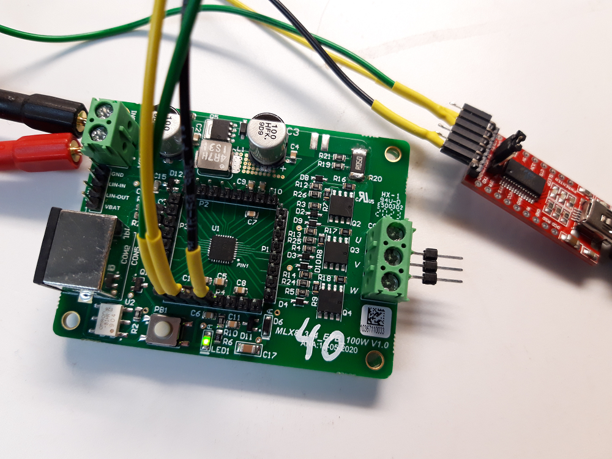
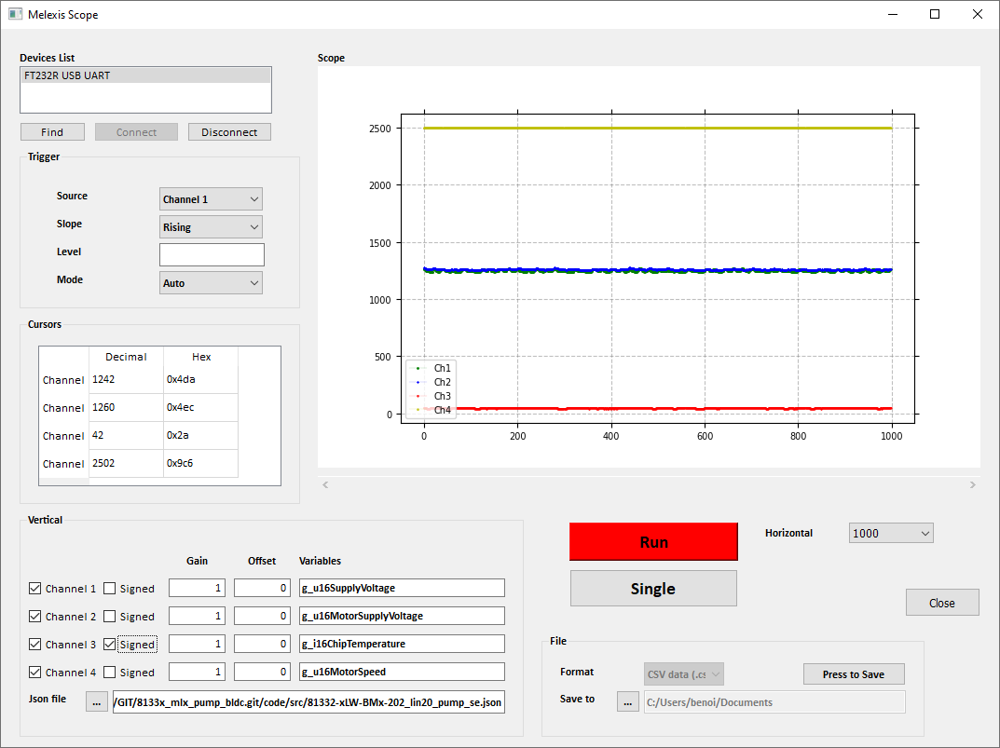

# BU-Act uart_plot interface Library

## General
* Customer: Melexis
* Product(s):  MLX81160, MLX81332/34, MLX81340/44/46
* Description: Libraries

## Getting started

 * This library configures the UART of your MLX IC to connect to Melexis Scope GUI.
 * This library can be used for logging or debugging.
 * Compatible with one standard UART-to-USB dongle.


@image latex debug_uart.png "UART-to-USB dongle connected to the Melexis MLX81340/44 100W EVB" width=11cm

## Melexis scope GUI

### Installation

https://softdist.melexis.com/custassetsJRightFrame?assetname=MELEXIS_SCOPE

### Usage


@image latex melexis_scope.png "Melexis Scope" width=11cm

## Hardware resources
 * 1x UART
 * 2x GPIO

## Library installation

Configuration is done in the *uart_plot_config.h* file. Copy the file from the template folder to your code/src folder and update the pins and baudrate.
Add *uart_plot* to the BU_LIBS list in the file Makefile.srcs.mk located in the application source folder.

```
BU_LIBS += uart_plot
```

## Library usage

```
#include <stdint.h>
#include <uart_plot.h>
int main (void)
{
    uart_plot_Init();
    uart_plot_Start();

    while (1)
    {
    }
}

INTERRUPT void _ADC_SAR_INT(void)
{
    uart_plot_SendFrame();
}
```

## License
Copyright (C) 2022-2024 Melexis N.V.

The Software is being delivered 'AS IS' and Melexis, whether explicitly or implicitly, makes no warranty as to its Use or performance.
The user accepts the Melexis Firmware License Agreement.

Melexis confidential & proprietary
